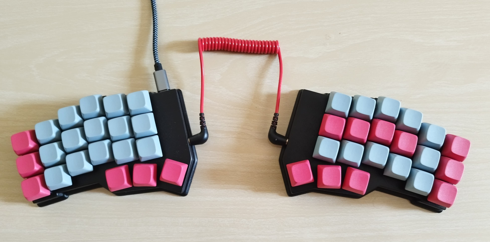

# Keyboard Split MK1

## Description

The Keyboard Split MK1 is a DIY split mechanical keyboard consisting of two independent halves, connected by a 3.5mm jack cable. Each half is controlled by an Arduino Micro. The keyboard has a total of 42 MX switches and keycaps, distributed between the two halves, providing a customizable typing experience.

The keyboard is fully programmable with QMK firmware, allowing for advanced keymapping and customization.

## Bill of Materials

- 2 Arduino Micro
- 2 TRRS jacks
- 42 MX switches
- 42 MX keycaps
- 42 1N4148 diodes
- 1 3.5mm jack cable
- 1 USB to USB-C cable
- Wires for connections

## QMK Firmware

The Keyboard Split MK1 is programmable using [QMK Firmware](https://qmk.fm/), a powerful open-source keyboard firmware. You can customize your keymap, add macros, and configure advanced features.

### Getting Started with QMK

1. Set up your development environment by following the [QMK installation guide](https://docs.qmk.fm/#/newbs_getting_started).
2. Clone the QMK firmware repository and navigate to your keyboard folder.
3. Customize your keymap in the `keymap.c` file.
4. Compile the firmware and flash it to your Arduino Micro boards using the QMK toolbox.

For more detailed instructions, refer to the [QMK documentation](https://docs.qmk.fm/).

## Available Files

- **Wiring Diagram**: [View wiring diagram](Images/Circuit.png)
- **STL Files**: [Access STL files](STL/)

## License

This program is distributed under the terms of the GNU General Public License (GPL), ensuring the freedom to redistribute and modify the software in accordance with free software standards.

## Author

Written by Catoni Mirko (IMprojtech)
